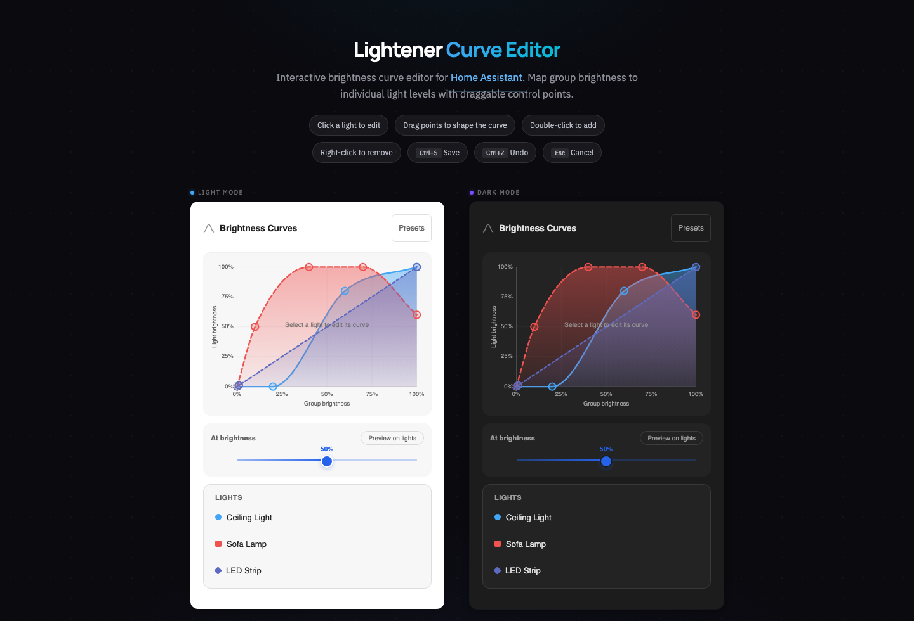

# Lightener Curve Editor (DevFork)

[![GitHub Release][releases-shield]][releases]
[![hacs][hacsbadge]][hacs]

> **This is a fork of [fredck/lightener](https://github.com/fredck/lightener) (v2.4.0).**
> It adds an interactive brightness curve editor card. The goal is to merge these features back upstream once stable.

Lightener is a Home Assistant integration used to create virtual lights that can control a group of lights. It offers the added benefit of controlling the state (on/off) and brightness level of each light independently.

**[Try the live demo](https://florianhorner.github.io/lightener-curve-editor/)** — interactive curve editor with light/dark theme toggle, no install needed.



## What This Fork Adds

### Curve Editor Card (`custom:lightener-curve-card`)

A visual editor for per-light brightness curves, directly in your HA dashboard — no more typing number pairs by hand.

- **Drag control points** on smooth bezier curves to shape each light's response
- **Double-click to add** a point, **right-click to remove** one
- **Brightness scrubber** with gradient track and inline value badges for each light
- **Scrubber + graph sync**: moving the scrubber shows a vertical indicator and per-curve dots directly on the graph
- **Colorblind-accessible**: dash patterns + shape markers (circle, square, diamond, triangle, bar) distinguish curves without relying on color alone
- **Keyboard navigation**: arrow keys on the scrubber, Enter/Space on legend items, Ctrl+S to save, Ctrl/Cmd+Z to undo, Esc to cancel
- **Layered panel design**: graph, scrubber, and legend each sit in their own tinted sub-panel
- **Theme-aware**: adapts to both HA light and dark modes
- **Scales from 2 to 20+ lights**: badges cap at 2 rows; excess badges collapse behind a "+N more" button, and long names truncate cleanly
- **Dim floor via origin drag**: drag the leftmost control point vertically to set a non-zero dim floor — a dashed stroke and `ns-resize` cursor indicate the constrained Y-only movement
- **Mobile-friendly**: touch-optimised controls with 44px touch targets
- **Mobile long-press delete**: remove a control point by long-pressing it on touch devices
- **Live light preview**: a **Preview** button in the card header pushes real brightness to all lights while you shape curves; the scrubber also pushes live brightness on drag. Lights restore automatically when preview stops, you navigate away, or the entity changes
- **Custom card title**: set a title in the card config or keep the default "Brightness Curves"
- **Visual card editor**: Home Assistant card config UI with native entity picker and optional title field
- **Admin-only editing**: non-admin users see curves in read-only mode
- **Curve presets**: one-click presets panel (Linear, Dim accent, Late starter, Night mode) with miniature SVG previews — applies to selected light or all lights at once, fully undoable

### WebSocket API

- `lightener/get_curves` — read brightness configs (all authenticated users)
- `lightener/save_curves` — write brightness configs (admin only)
- `lightener/list_entities` — list available Lightener entities (used by the sidebar panel)

### Upstream Status

| Feature | Status |
|---------|--------|
| Curve editor card + WebSocket API | Fork-only, planned for upstream PR once stable |
| All upstream v2.4.0 functionality | Included, unchanged |

### Switching Back to Upstream

Remove `florianhorner/lightener-curve-editor` from HACS custom repositories and reinstall "Lightener" from the default HACS store. The curve editor card will stop working but all Lightener devices and automations remain unaffected.

## Installing This Fork

1. In HACS, go to the three-dot menu and select "Custom repositories"
2. Add `florianhorner/lightener-curve-editor` as an Integration
3. Search for "Lightener Curve Editor" and install it
4. Restart Home Assistant
5. Add a card to your dashboard:

```yaml
type: custom:lightener-curve-card
entity: light.your_lightener_device
```

### Sidebar Panel

This fork also registers a dedicated sidebar panel at `/lightener-editor` named **Lightener Editor**.  
Use it to pick a Lightener entity and edit curves without manually adding a dashboard card first.

## Documentation

- [CHANGELOG.md](CHANGELOG.md) — release history
- [CONTRIBUTING.md](CONTRIBUTING.md) — local setup, tooling, and workflow
- [SECURITY.md](SECURITY.md) — vulnerability reporting policy
- [DESIGN.md](DESIGN.md) — UI tokens, patterns, and accessibility baseline
- [CLAUDE.md](CLAUDE.md) — repository notes for AI-assisted contributors
- [TODOS.md](TODOS.md) — tracked follow-up work

## Local Development

For backend work, use the repo-owned Python bootstrap and test runner instead
of bare `pytest`:

```sh
scripts/setup-python
scripts/test-fast
```

See [CONTRIBUTING.md](CONTRIBUTING.md) for the full backend and frontend
workflow, including direct `scripts/ha-sync` deployment to a test HA box
without cutting a release.

## Example Use Case

Suppose you have the following lights in your living room, all available as independent entities in Home Assistant:

- Main ceiling light
- LED strip around the ceiling
- Sofa lamp

You want to **control all lights at once**, such as having a single switch on the wall to turn all lights on/off. It's an easy task, simply create a simple automation for that.

Now, you want something magical: the ability to **control the brightness of the whole room at once**. You don't want all three lights to have the same brightness level (e.g., all at 30%). Instead, you want each light to gradually match the room's brightness level. For example:

- Room brightness 0% to 40%: the ceiling LEDs gradually reach 50% of their brightness.
- Room brightness from 20%: the sofa light gradually joins in.
- Room brightness 60%: the sofa light is at 100%, and the main light joins in gradually.
- Room brightness 80%: the ceiling LEDs are at 100% (sofa light remains at 100%).
- Room brightness 100%: the main light is at 100% (sofa light and LEDs still at 100%).

Here's a screencast demonstrating the above in action:


Lightener makes this magic possible.

## Installation

### Using HACS (upstream)

For the original Lightener without the curve editor, search for `Lightener` in HACS.

### Manual

Copy the `custom_components/lightener` directory from this repository to `config/custom_components/lightener` in your Home Assistant installation.

## Creating Lightener Lights

After planning how you want your lights to work, it's time to create Lightener (virtual) lights that will control them.

To start, follow these steps in your Home Assistant installation:

1. Go to "Settings > Devices & Services" to access the "Integrations" page.
2. Click the "+ Add Integration" button.
3. Search for and select the "Lightener" integration.

The setup flow has two steps:

1. Give a name to your Lightener light — something that reflects the space, like "Living Room".
2. Select the lights you want to control, and pick a starting curve preset (Linear, Dim Accent, Late Starter, or Night Mode).

That's it. A new device is created immediately. Each light starts with the preset curve you chose.

### Editing Brightness Curves

After setup, use the **Lightener Editor** sidebar panel (`/lightener-editor`) or add a `custom:lightener-curve-card` to any dashboard to visually edit each light's brightness curve.

The curve maps "group brightness %" to "this light's brightness %". For example, the curve for a sofa lamp might stay at zero until the room hits 20%, then ramp up to 100% by 60%. Drag the control points to shape the response — no number entry required.

The conceptual rules still apply:

- A light doesn't have to reach 100%. Shape its top end wherever you like.
- Brightness can increase and then decrease — useful for accent lights that peak mid-range.
- Setting a point to zero turns the light off at that group brightness level.
- The rightmost point always defaults to 100:100 unless you change it.

Once the configuration is confirmed, a new device becomes available, which can be used in the UI or in automations to control all the lights in the room at once.

One light to rule them all!

### Support for On/Off Lights

Lightener supports controlling so-called "On/Off Lights." These are lights that cannot be dimmed but can only be turned on and off.

The configuration of On/Off Lights is similar to dimmable lights. The difference is that if the light is set to zero, it will be off. Any other "brightness" level will simply turn the light on.

For example, if an On/Off Light is configured with "20:0, 50:30, 100:0," it will be set to off when the Lightener is in the brightness range of 0-20% or when it reaches 100%. Between 21-99%, the light will be on.

### Tips

- A light doesn't have to always go to 100%. If you don't want it to exceed, for example, 80%, you can configure it with `100:80`.
- Brightness can both increase and decrease. For example, `60:100` + `100:20` will make a light be at 100% brightness when the room is at 60%, and then decrease its brightness until 20% when the room is at 100%.
- A light can be turned off at any point by setting it to zero. For example, `30:100` + `60:0` will make it go to 100% when the room is at 30% and gradually turn off until the room reaches 60% (and then back to 100% at 100% because of the following point).
- Lights will automatically have a `100:100` configuration, so if you need to change the default behavior at 100%, you can adjust it accordingly.

Have fun!

[hacs]: https://github.com/hacs/integration
[hacsbadge]: https://img.shields.io/badge/HACS-Default-41BDF5.svg?style=for-the-badge

[releases-shield]: https://img.shields.io/github/release/florianhorner/lightener-curve-editor.svg?style=for-the-badge&include_prereleases
[releases]: https://github.com/florianhorner/lightener-curve-editor/releases
